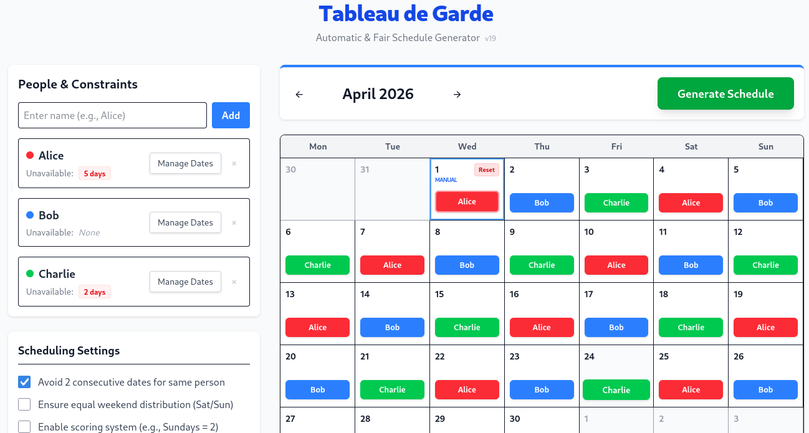

# Tableau de Garde (TDG)

Automatic & Fair Schedule Generator.

https://tableau-garde.deno.dev/



## Features

- **Automatic Generation**: Uses Z3 solver to generate fair and optimal
  schedules.
- **Fairness Constraints**:
  - Avoid consecutive dates for the same person.
  - Equal weekend distribution (Saturdays/Sundays).
  - Recency consideration (optional).
  - Opportunity-based distribution.
- **Manual Assignments**: Override automatic scheduling by manually assigning
  people to specific dates.
- **Unavailability Management**: Specify dates when people are unavailable.
- **Real-time Feedback**: Visual indicators for manual assignments and
  constraints.

## Tech Stack

- [Fresh 2.0](https://fresh.deno.dev/) (Deno)
- [Vite](https://vitejs.dev/)
- [Z3-solver](https://github.com/Z3Prover/z3) (WebAssembly)
- [Tailwind CSS](https://tailwindcss.com/)

## Usage

Make sure to install [Deno](https://deno.com/).

Then start the project in development mode:

```bash
deno task dev
```

To build and serve the production version:

```bash
deno task build
deno task start
```

## Testing

The project includes several tests for the scheduler logic:

```bash
deno task test-browser
```
